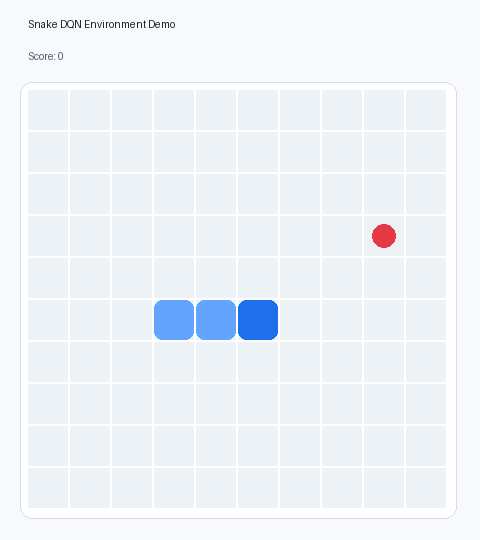
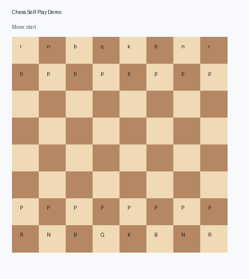

# RL Chess and Snake Lab

This repo is a small reinforcement learning lab with two game agents: Snake and Chess. The goal is to show the core ideas behind RL in a way that is readable, testable, and honest about what each system can and cannot learn.

Snake is the main DQN experiment because the environment is simple enough for learning behavior to become visible. Chess is included as a harder self-play experiment that uses legal moves and board features, but it is not trying to be a strong chess engine.

## Demo

Snake environment demo:



Chess self-play demo:



## What This Project Shows

- a custom Gym-style Snake environment
- a Gymnasium compatible wrapper for Snake
- replay memory for off-policy reinforcement learning
- a PyTorch DQN model for Snake
- epsilon-greedy exploration
- a self-play chess environment using `python-chess`
- chess board feature encoding for neural networks
- small tests for game rules and RL helpers
- demo assets that make the project easy to inspect on GitHub

## Why Snake and Chess

Snake is useful for learning RL fundamentals because the state is small, the rewards are clear, and progress can be seen visually.

Chess is much harder because the action space changes every turn, the reward is delayed, and good play requires long-term planning. This project treats chess as an educational self-play experiment rather than pretending it can beat a real engine after a few minutes of training.

## Project Structure

```text
rl_lab/
  common/
    dqn.py          Shared PyTorch DQN model
    replay.py       Replay memory
  snake/
    env.py          Snake environment
    gym_env.py      Gymnasium compatible Snake wrapper
    train.py        DQN training loop
    demo.py         Snake demo helper
  chess_rl/
    env.py          Chess self-play environment
    features.py     Board encoding and material score
    model.py        Small chess value network
    train.py        Self-play training experiment
    demo.py         Chess demo helper
tests/              Unit tests
scripts/            Demo asset generation
docs/media/         GIF demos for GitHub
```

## Setup

```bash
python -m venv .venv
.venv\Scripts\activate
pip install -e ".[dev]"
```

You can also install from `requirements.txt`:

```bash
pip install -r requirements.txt
```

## Run Tests

```bash
python -m pytest -q
```

## Run the Snake Experiment

```bash
python -m rl_lab.snake.train
```

This trains a small DQN and saves weights to `snake_dqn.pt`.

## Run the Chess Experiment

```bash
python -m rl_lab.chess_rl.train
```

This runs a short educational self-play loop and saves weights to `chess_policy.pt`.

## Regenerate Demo GIFs

```bash
python scripts/make_demo_gifs.py
```

The demos are intentionally lightweight. They are meant to make the repo easy to understand quickly, not to claim the agents are fully trained.

## Notes on Reinforcement Learning

Reinforcement learning is different from normal supervised learning. Instead of learning from labeled examples, an agent learns by taking actions, receiving rewards, and slowly improving its policy.

In this repo:

- the Snake agent receives positive reward for eating food
- the Snake agent receives negative reward for dying
- replay memory stores old experiences so the model can learn from them more than once
- epsilon-greedy exploration lets the agent try random moves early in training
- the Chess experiment uses legal moves from `python-chess` and simple rewards from material changes and game outcomes

## Limitations

The Snake agent can learn useful behavior with enough training, but the default settings are kept small so the code is easy to run.

The Chess agent is a starting point for self-play research, not a competitive chess AI. A strong chess RL system would need a much deeper network, better search, more training time, and a stronger reward design.

## Future Ideas

- add training curves for score over time
- compare random, heuristic, and trained Snake agents
- add model checkpoint loading for demos
- add a stronger chess policy head over legal moves
- add Monte Carlo tree search for chess
- log experiments with simple CSV files
